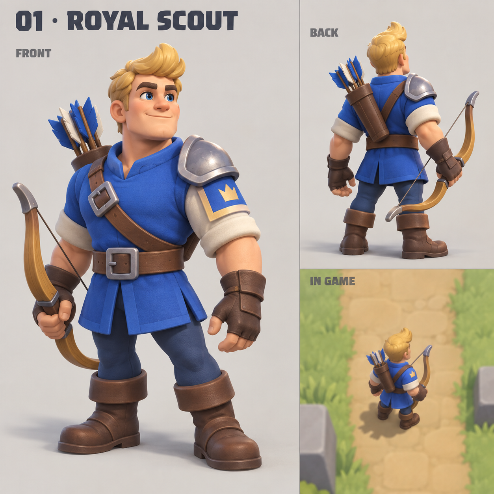
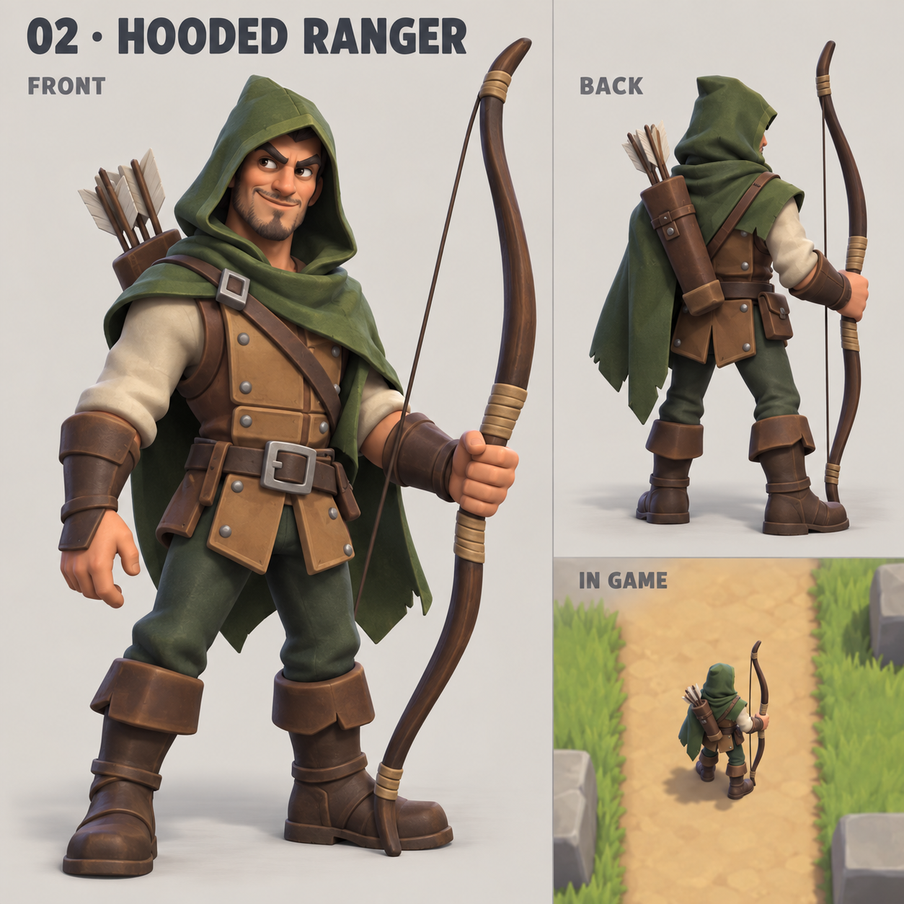
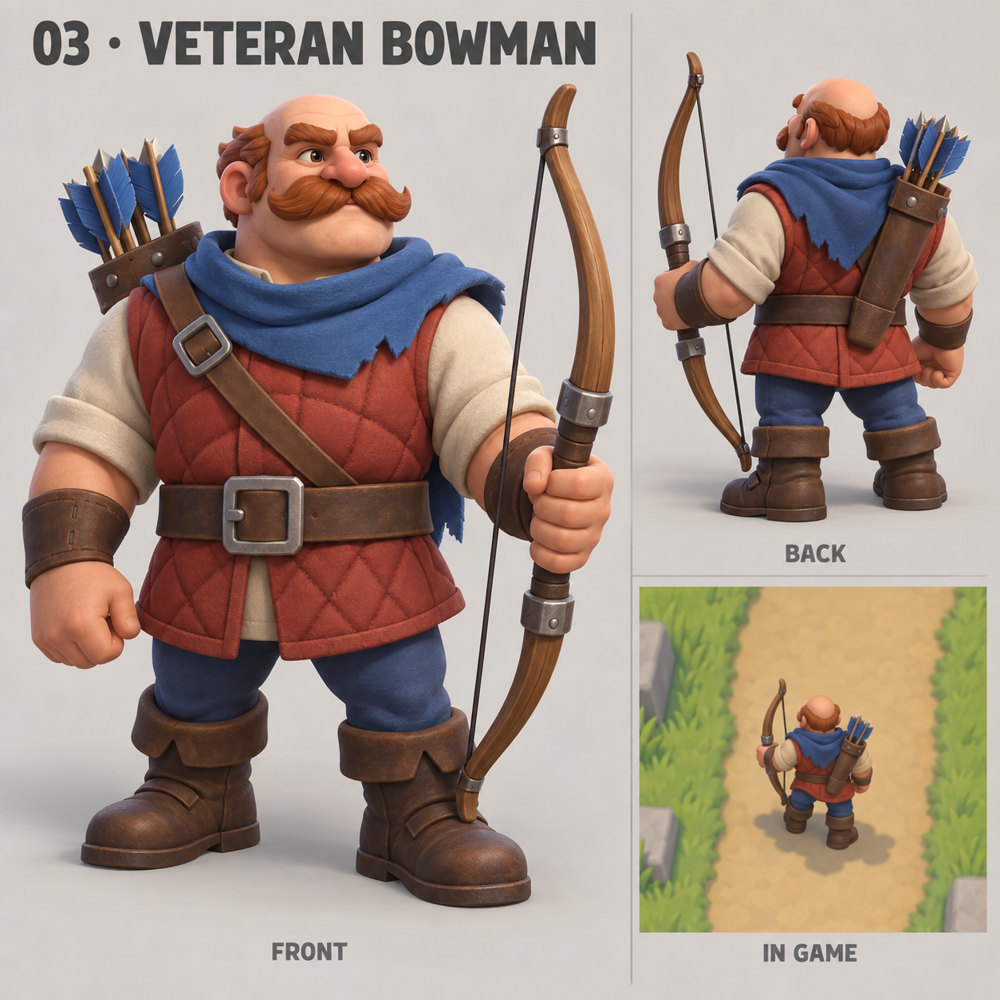
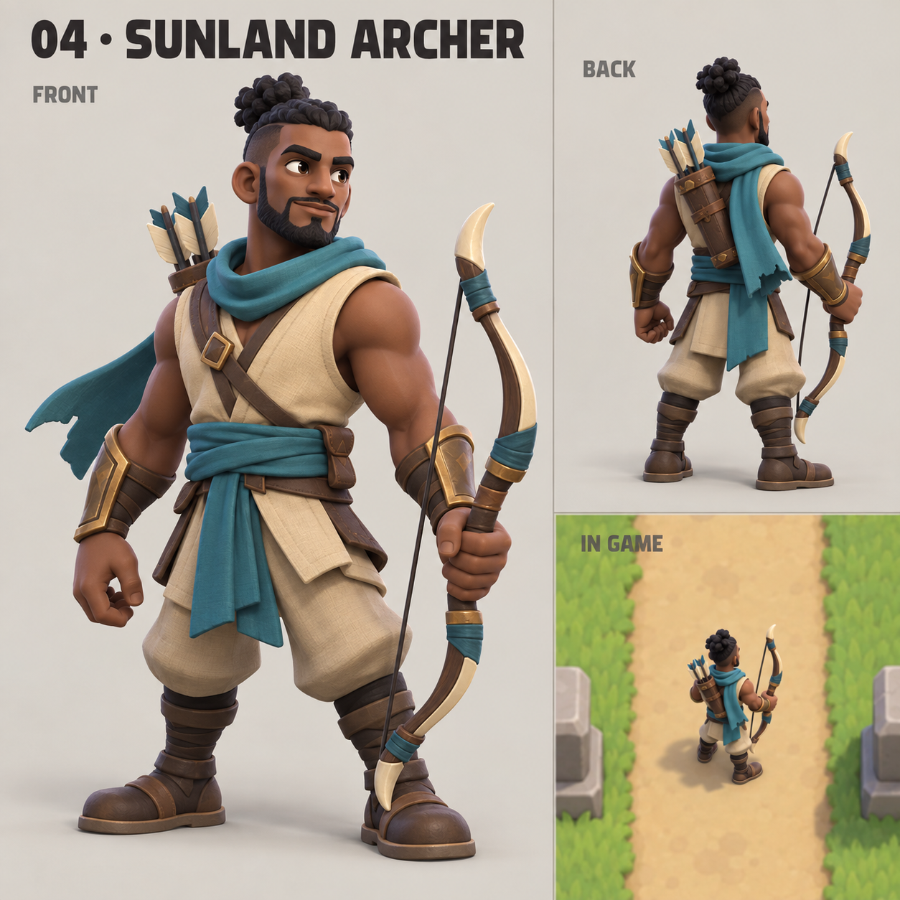
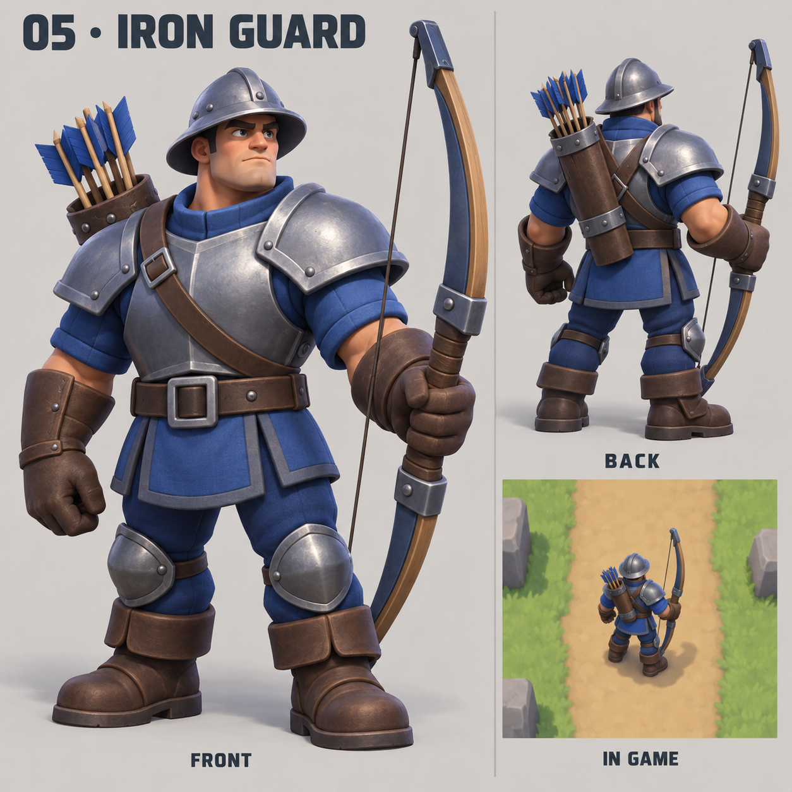

# Archer design alternatives v1

Five original male human archers generated with the built-in image_gen tool, 2026-09-16. Requested visual direction: Clash Royale. Status: concept previews for selection; not integrated into the game and not animation sheets. Each sheet includes front and rear views and an illustrative battlefield inset. Insets show the intended camera, not a verified CSS-pixel scale of the running prototype.

The existing gameplay and current unit art remain separate from these alternatives.

## 01-royal-scout



Generated source: C:/Users/mrmay/.codex/generated_images/01a0a042-20a3-70b1-8f12-d5a1c5bfb3a1/exec-3dac276b-e4e8-43e0-820d-e15c82d699bd.png

Exact built-in prompt:

```text
Use case: stylized-concept. Create one polished CHARACTER DESIGN CHOICE BOARD for a mobile King's Guard tower-defense prototype. A male HUMAN archer, in the visual style of Clash Royale: sculpted toy-like stylized 3D render, chunky appealing readable shapes, broad expressive face, large hands and boots, about 3 heads tall, rounded bevels, clean materials, soft ambient occlusion and studio illumination, blue-team fantasy aesthetic where relevant. This is original character concept art, not an existing Clash Royale character. No photorealism, no pixel art, no elf ears, no female archer, no crossbow, no magic, no tiny noisy ornaments. An unmistakable curved BOW with visible string and quiver of ARROWS; natural hand grip and anatomy.
Layout: square presentation, pale warm grey background, subtle dividing line. Left two thirds: a large complete full-body front three-quarter view, feet and entire bow fully visible, generous margin. Upper right: medium complete rear three-quarter view of the SAME character, showing how he faces upward toward enemies in the game. Lower right: a restrained tiny portrait-mobile battlefield excerpt, sandy path and quiet grass, containing the SAME archer only about 50 pixels tall when this 1024px board is viewed at full size, rear three-quarter facing upward; no phone hardware, no UI dashboard. This tiny inset is for actual small-screen legibility, not a giant hero illustration. Keep all three representations IDENTICAL in equipment, identity and palette. Typography: one crisp numbered title at top, short labels FRONT / BACK / IN GAME. No extra description text. Professional readable restrained game character concept sheet.
Text title (verbatim): "01 · ROYAL SCOUT".
Character design: A young clean-shaven cheerful human man with a very broad square jaw, thick eyebrows and a pronounced blond quiff. Compact athletic body. NO hood or helmet. Short royal-blue padded tunic, cream sleeves, one small rounded steel shoulder guard, wide brown belt, short brown boots and leather fingerless bracer. A compact stout honey-coloured wooden recurve bow with simple steel tips. Distinctive silhouette: blond hair tuft, short blue tunic, clean exposed face. Friendly confident look.
```

## 02-hooded-ranger



Generated source: C:/Users/mrmay/.codex/generated_images/01a0a042-20a3-70b1-8f12-d5a1c5bfb3a1/exec-541c7064-d68d-44ee-9e1d-0737c27d9848.png

Exact built-in prompt:

```text
Use case: stylized-concept. Create one polished CHARACTER DESIGN CHOICE BOARD for a mobile King's Guard tower-defense prototype. A male HUMAN archer, in the visual style of Clash Royale: sculpted toy-like stylized 3D render, chunky appealing readable shapes, broad expressive face, large hands and boots, about 3 heads tall, rounded bevels, clean materials, soft ambient occlusion and studio illumination, blue-team fantasy aesthetic where relevant. This is original character concept art, not an existing Clash Royale character. No photorealism, no pixel art, no elf ears, no female archer, no crossbow, no magic, no tiny noisy ornaments. An unmistakable curved BOW with visible string and quiver of ARROWS; natural hand grip and anatomy.
Layout: square presentation, pale warm grey background, subtle dividing line. Left two thirds: a large complete full-body front three-quarter view, feet and entire bow fully visible, generous margin. Upper right: medium complete rear three-quarter view of the SAME character, showing how he faces upward toward enemies in the game. Lower right: a restrained tiny portrait-mobile battlefield excerpt, sandy path and quiet grass, containing the SAME archer only about 50 pixels tall when this 1024px board is viewed at full size, rear three-quarter facing upward; no phone hardware, no UI dashboard. This tiny inset is for actual small-screen legibility, not a giant hero illustration. Keep all three representations IDENTICAL in equipment, identity and palette. Typography: one crisp numbered title at top, short labels FRONT / BACK / IN GAME. No extra description text. Professional readable restrained game character concept sheet.
Text title (verbatim): "02 · HOODED RANGER".
Character design: A lean, wiry human man with olive skin, pointed human chin but ROUND HUMAN EARS, dark brows, little short dark stubble and crooked confident grin. Distinct deep moss-green angular hood frames his face, narrow waist and asymmetric short green cape, weathered tan leather brigandine with large simple panels, long chunky boots. No plate shoulders. Long curved dark wooden yew bow nearly his own height, wrapped tan grip. Distinctive silhouette: pointed hood, cape sweeping one side, tall elegant bow. Sly experienced woodsman, visibly different from a royal soldier.
```

## 03-veteran-bowman



Generated source: C:/Users/mrmay/.codex/generated_images/01a0a042-20a3-70b1-8f12-d5a1c5bfb3a1/exec-e54d70e3-dc7c-41e1-b322-c2f95f53e2bd.png

Exact built-in prompt:

```text
Use case: stylized-concept. Create one polished CHARACTER DESIGN CHOICE BOARD for a mobile King's Guard tower-defense prototype. A male HUMAN archer, in the visual style of Clash Royale: sculpted toy-like stylized 3D render, chunky appealing readable shapes, broad expressive face, large hands and boots, about 3 heads tall, rounded bevels, clean materials, soft ambient occlusion and studio illumination, blue-team fantasy aesthetic where relevant. This is original character concept art, not an existing Clash Royale character. No photorealism, no pixel art, no elf ears, no female archer, no crossbow, no magic, no tiny noisy ornaments. An unmistakable curved BOW with visible string and quiver of ARROWS; natural hand grip and anatomy.
Layout: square presentation, pale warm grey background, subtle dividing line. Left two thirds: a large complete full-body front three-quarter view, feet and entire bow fully visible, generous margin. Upper right: medium complete rear three-quarter view of the SAME character, showing how he faces upward toward enemies in the game. Lower right: a restrained tiny portrait-mobile battlefield excerpt, sandy path and quiet grass, containing the SAME archer only about 50 pixels tall when this 1024px board is viewed at full size, rear three-quarter facing upward; no phone hardware, no UI dashboard. This tiny inset is for actual small-screen legibility, not a giant hero illustration. Keep all three representations IDENTICAL in equipment, identity and palette. Typography: one crisp numbered title at top, short labels FRONT / BACK / IN GAME. No extra description text. Professional readable restrained game character concept sheet.
Text title (verbatim): "03 · VETERAN BOWMAN".
Character design: A stocky barrel-chested older human man, ruddy skin, large bushy auburn moustache, bushy auburn eyebrows, bare bald crown with hair at sides, broad nose; friendly stubborn expression. Short strong legs, big forearms. Padded rust-red sleeveless quilted jerkin over oatmeal shirt, wide leather waist belt, battered simple blue shoulder scarf, brown chunky boots. Thick heavy natural wood longbow with a metal-reinforced central grip and thick arrows. NO hood, NO helmet, NO slim elf-like build. Distinctive silhouette: round bald head, monumental moustache, wide chest and forearms.
```

## 04-sunland-archer



Generated source: C:/Users/mrmay/.codex/generated_images/01a0a042-20a3-70b1-8f12-d5a1c5bfb3a1/exec-4b69da30-61ab-4e59-9e26-bbc8cf2facf3.png

Exact built-in prompt:

```text
Use case: stylized-concept. Create one polished CHARACTER DESIGN CHOICE BOARD for a mobile King's Guard tower-defense prototype. A male HUMAN archer, in the visual style of Clash Royale: sculpted toy-like stylized 3D render, chunky appealing readable shapes, broad expressive face, large hands and boots, about 3 heads tall, rounded bevels, clean materials, soft ambient occlusion and studio illumination, blue-team fantasy aesthetic where relevant. This is original character concept art, not an existing Clash Royale character. No photorealism, no pixel art, no elf ears, no female archer, no crossbow, no magic, no tiny noisy ornaments. An unmistakable curved BOW with visible string and quiver of ARROWS; natural hand grip and anatomy.
Layout: square presentation, pale warm grey background, subtle dividing line. Left two thirds: a large complete full-body front three-quarter view, feet and entire bow fully visible, generous margin. Upper right: medium complete rear three-quarter view of the SAME character, showing how he faces upward toward enemies in the game. Lower right: a restrained tiny portrait-mobile battlefield excerpt, sandy path and quiet grass, containing the SAME archer only about 50 pixels tall when this 1024px board is viewed at full size, rear three-quarter facing upward; no phone hardware, no UI dashboard. This tiny inset is for actual small-screen legibility, not a giant hero illustration. Keep all three representations IDENTICAL in equipment, identity and palette. Typography: one crisp numbered title at top, short labels FRONT / BACK / IN GAME. No extra description text. Professional readable restrained game character concept sheet.
Text title (verbatim): "04 · SUNLAND ARCHER".
Character design: An agile dark-skinned human male archer, narrow face, black curly hair pulled into a short high knot, shaved sides, neatly trimmed short beard. Alert calm expression. Sleeveless sand-coloured overlapping cloth-and-leather vest, teal waist sash and scarf hanging behind one shoulder, bronze forearm guards, loose short trousers and wrapped boots. Compact strongly curved horn-and-wood composite recurve bow with cream bone tips. NO turban, NO hood, NO European steel breastplate. Distinctive silhouette: topknot, exposed strong arms, broad teal sash, strongly recurved bow. Clearly a practical military archer, not a mage.
```

## 05-iron-guard



Generated source: C:/Users/mrmay/.codex/generated_images/01a0a042-20a3-70b1-8f12-d5a1c5bfb3a1/exec-b5b4ea95-26b8-4e08-b841-5469df92ef0a.png

Exact built-in prompt:

```text
Use case: stylized-concept. Create one polished CHARACTER DESIGN CHOICE BOARD for a mobile King's Guard tower-defense prototype. A male HUMAN archer, in the visual style of Clash Royale: sculpted toy-like stylized 3D render, chunky appealing readable shapes, broad expressive face, large hands and boots, about 3 heads tall, rounded bevels, clean materials, soft ambient occlusion and studio illumination, blue-team fantasy aesthetic where relevant. This is original character concept art, not an existing Clash Royale character. No photorealism, no pixel art, no elf ears, no female archer, no crossbow, no magic, no tiny noisy ornaments. An unmistakable curved BOW with visible string and quiver of ARROWS; natural hand grip and anatomy.
Layout: square presentation, pale warm grey background, subtle dividing line. Left two thirds: a large complete full-body front three-quarter view, feet and entire bow fully visible, generous margin. Upper right: medium complete rear three-quarter view of the SAME character, showing how he faces upward toward enemies in the game. Lower right: a restrained tiny portrait-mobile battlefield excerpt, sandy path and quiet grass, containing the SAME archer only about 50 pixels tall when this 1024px board is viewed at full size, rear three-quarter facing upward; no phone hardware, no UI dashboard. This tiny inset is for actual small-screen legibility, not a giant hero illustration. Keep all three representations IDENTICAL in equipment, identity and palette. Typography: one crisp numbered title at top, short labels FRONT / BACK / IN GAME. No extra description text. Professional readable restrained game character concept sheet.
Text title (verbatim): "05 · IRON GUARD".
Character design: A tall broad-shouldered muscular human male military archer with a wide square chin, serious young face, dark cropped hair. A simple open-faced steel kettle helmet casts a shadow over his eyes; FACE STILL VISIBLE. Blue padded uniform beneath large clean steel chest-and-shoulder plates, huge leather gauntlet bracers, steel knee guards over chunky brown boots. No cape, no hood. Massive but practical thick blue-steel-and-wood war bow almost his height, thick fletched arrows in a large quiver. NO sword, no shield, no crossbow. Distinctive silhouette: wide steel kettle helmet, broad protected shoulders, powerful legs, massive war bow.
```
