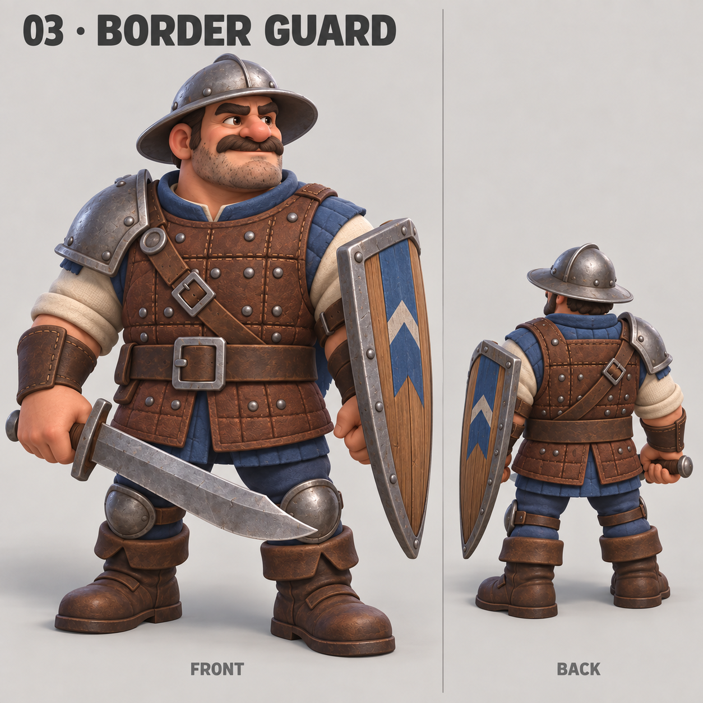

# 03 · Border Guard

Status: generated and visually reviewed; concept for user selection, not integrated into the game.



Saved source: C:/Users/mrmay/.codex/generated_images/01a0a042-20a3-70b1-8f12-d5a1c5bfb3a1/exec-046768e2-249b-4bf4-a840-00e26ac128d2.png. Copied unchanged to 03-border-guard.png; original preserved.

The board shows front and rear views of a stocky human swordsman with a wide-brim steel helmet, visible face, leather armor, short falchion and wooden kite shield. No walking or combat animation is represented by this concept sheet.

Tool: built-in image_gen. One image requested at a time.

Style reference: ../archer-concepts-v1/03-veteran-bowman.png

## Exact prompt

```text
undefined
```
