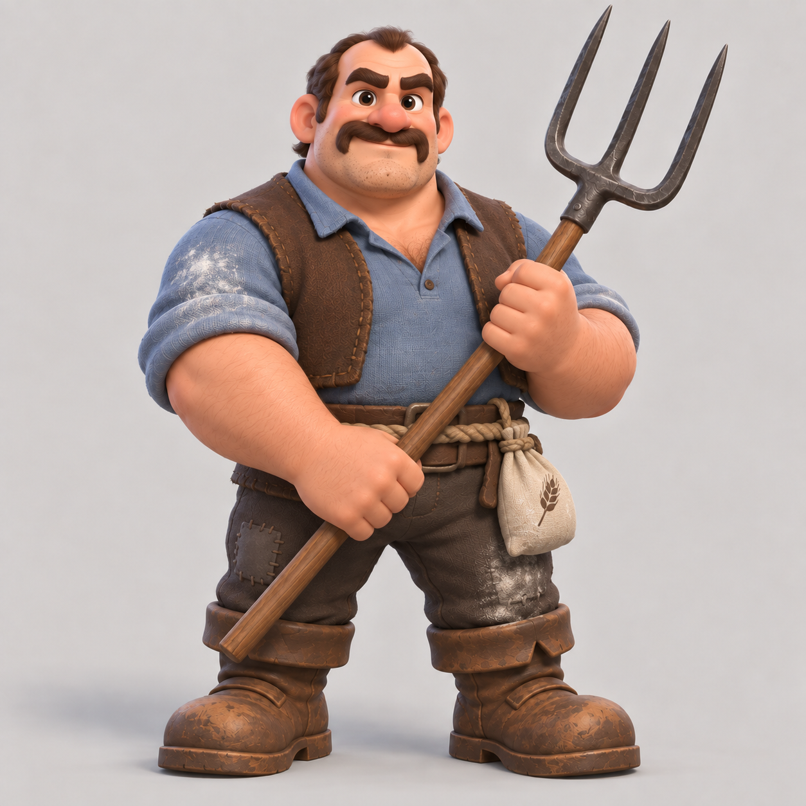

# 05 — Miller, front view

Status: generated concept only; not integrated into the game.

Generator: built-in imagegen.

Source: `C:/Users/mrmay/.codex/generated_images/01a0a042-20a3-70b1-8f12-d5a1c5bfb3a1/exec-832d327f-3cf7-4c71-8d48-5d8401421d6a.png`

Style reference: `04-farmhand-front.png` (approved farmhand concept).

## Exact generation prompt

Use case: stylized-concept. Create ONE full-body FRONT VIEW of a new male human PEASANT WITH A FARM PITCHFORK for the mobile fantasy game King's Guard.
The supplied farmhand image is the APPROVED STYLE reference. Match its appealing chunky toy-like 3D rendering, large expressive head and hands, short strong legs, soft studio light, restrained earthy colors, round sculpted shapes, readable clothes and believable wood/iron. This is a DIFFERENT recruit, not a repaint or costume edit of the same boy. It must fit beside the reference in the same Clash Royale-inspired game.

Character: THE MILLER, a stocky middle-aged working man around40, visibly older, broader and more powerful than the young green-capped farmhand. Large barrel chest and round belly, massive forearms, thick neck, oversized sturdy hands and broad boots, approximately three heads tall. Medium warm tan skin, close-cropped DARK BROWN hair with slightly receding hairline, thick dark eyebrows and a prominent dark horseshoe moustache, clean chin with subtle stubble, broad square nose. Calm stubborn friendly expression, not angry or villainous. No hat and no helmet. No curls or green cap like the reference.
Clothing: dusty BLUE linen work shirt with sleeves rolled high above elbows, short open DARK BROWN LEATHER working waistcoat, a broad rope-and-leather waist belt, patched charcoal-brown trousers and large worn brown boots. A small simple flour sack hangs from the belt at one hip; discreet pale flour dust on sleeve or knee. Simple rural work clothes, NO metal armor, knight shoulder pads, cape, expensive jewelry, modern overalls or giant fantasy buckles.
Tool: a heavy but practical FARM PITCHFORK with a thick plain ashwood handle and THREE clearly separated plain dark iron prongs. Agricultural hayfork, not a royal or magical trident. He holds it in BOTH HANDS at different heights diagonally beside his torso; complete prongs and shaft visible and face unobstructed. Natural grips and anatomy, no extra fingers, hands or weapons. Grounded relaxed battle-ready stance with both boots planted apart.
Composition: exactly ONE character facing the viewer, only FRONT view. Square image, plain warm pale-grey studio backdrop and subtle contact shadow, whole body large in the frame with safe margins above all fork tips and below boots. No side view, no rear view, no alternate poses, no environment, no game interface, no text, no labels, no logos.
Keep silhouette compact and strong, not a tall realistic adult, not an exaggerated bodybuilder, not an ogre or dwarf species. Human ears and human face. Keep the reference's polished rounded mobile-game art quality and legible shapes.
